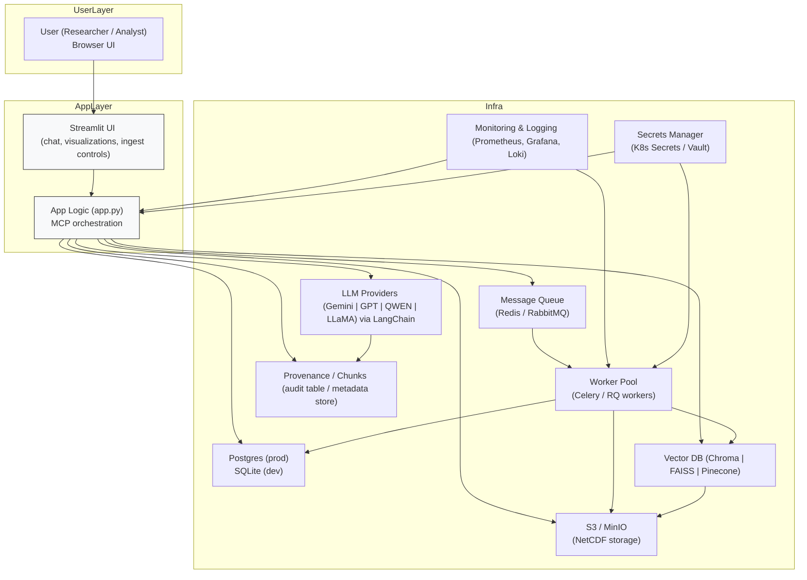
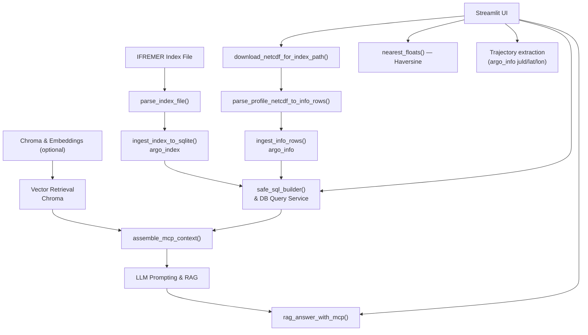

# ARGO RAG Explorer — Professional README

[](LICENSE) [](#) [](#) [](#)

> **A production-grade, research-focused platform for ARGO float exploration — combining NetCDF parsing, geospatial indexing, interactive visualization, and grounded LLM answers (RAG + MCP).**

---

## Table of Contents

1. [Quick Visual](#quick-visual)
2. [Why this project](#why-this-project)
3. [Features (short)](#features-short)
4. [Architecture & Data Flow](#architecture--data-flow)
5. [Getting Started (Quickstart)](#getting-started-quickstart)
6. [UI Walkthrough (what each tab does)](#ui-walkthrough-what-each-tab-does)
7. [MCP & RAG — Deep dive](#mcp--rag---deep-dive)
8. [Exports & Integration points](#exports--integration-points)
9. [Production Notes & Recommendations](#production-notes--recommendations)
10. [Developer Guide & Extensibility](#developer-guide--extensibility)
11. [Troubleshooting & Known Limitations](#troubleshooting--known-limitations)
12. [Contribute / License / Credits](#contribute--license--credits)

---

## Advanced Architecture Diagram

This section contains the **production-oriented architecture** that matches the Background, Description, and Expected Solution you provided — now updated to explicitly show production choices (Postgres, Celery/Redis, S3/Object Storage, vector-store alternatives, provenance/chunks, monitoring, and secrets management).

### Architecture (image + mermaid)

> **Recommended files to add to repo**:
>
> * `docs/architecture/argo_architecture_advanced.svg`
> * `docs/architecture/argo_architecture_advanced.png`

Embed with Markdown:

```md
### Architecture (advanced)


*Figure: Advanced architecture — Streamlit app, background workers (Celery), Postgres, S3/MinIO, Chroma/FAISS/Pinecone, LLM providers and monitoring.*
```

For readers who prefer a rendered diagram or cannot render the image inline, a clean Mermaid representation is provided below for use in mermaid.live or GitHub when supported. (Note: complex diagrams often render more reliably as PNG/SVG images than raw Mermaid on GitHub.)



### Diagram explanation & mapping to requirements

* **Postgres (prod) / SQLite (dev)**: Postgres is recommended for production deployments to handle concurrent writes and analytical workloads. The README and diagram explicitly show Postgres as the production default.
* **Object Storage (S3 / MinIO)**: persistent store for downloaded NetCDF files. Workers and the app read/write to shared object storage to avoid duplicate downloads across instances.
* **Worker Pool (Celery / RQ)**: replace `multiprocessing` with a robust task queue to handle index ingestion, NetCDF downloads, parsing, and vectorization reliably and at scale.
* **Message Queue (Redis / RabbitMQ)**: broker for tasks; result backend and rate-limiting for LLM calls.
* **Vector Store (Chroma | FAISS | Pinecone)**: optional but recommended for semantic retrieval; the diagram shows alternatives and how vectors persist to object storage where applicable.
* **LLM Providers**: pluggable providers (Gemini shown in code as default when configured) — the architecture allows swapping LLMs with LangChain adapters.
* **Provenance / Chunks**: a metadata table or store that records MCP chunks and vector hit metadata to ensure auditable LLM responses.
* **Monitoring & Secrets**: recommended production integrations (Prometheus/Grafana, Loki/ELK, and Vault/K8s secrets).

---

### Operational notes (what changed vs. the original README)

* Documented and recommended **Postgres** as production DB instead of using SQLite by default.
* Replaced `multiprocessing` background processes with a **queue + workers** pattern (Celery/RQ + Redis/RabbitMQ) in the diagram and notes.
* Explicitly calls out **vector-store alternatives** and shared persistence (duckdb+parquet or S3) for Chroma.
* Added **provenance/chunk** storage for auditability of RAG outputs.
* Added **monitoring, secrets, and rate-limiting** notes to reflect production operational needs.

---

## Why this project

This repo is built for reproducible oceanographic analysis workflows where domain data (ARGO floats) must be: parsed reliably, stored for efficient queries, visualized interactively, and explained or summarized by LLMs in a grounded/traceable way. It is suitable for researchers, operations teams, and engineers who need a hybrid SQL+RAG approach with auditability.

---

## Features (short)

* Robust NetCDF (.nc) parsing to structured `argo_info` rows (temp, salinity, pressure, time, metadata).
* Index ingestion (`argo_index`) from IFREMER/GDAC index files.
* Place-based geocoding (Nominatim) with sane fallbacks.
* Nearest-float Haversine search, interactive Plotly Mapbox maps.
* Profile comparison (temp/depth, pres/depth, temp vs time) with aggregation options.
* Conversational interface (RAG) with MCP grounding: returns structured JSON answers (answer, recommended SQL, references).
* Optional vector search via ChromaDB — integrated into MCP context.
* Background ingestion & Chroma build workers, status tracking.
* Exports: CSV / Parquet / NetCDF for downstream workflows.

---

## Architecture & Data Flow

**High-level flow**:

1. Index download → parse → persist to `argo_index`.
2. `.nc` download → parse to per-sample rows → persist to `argo_info`.
3. UI queries use `safe_sql_builder()` to construct parameterized SQL (index or measurement queries).
4. For measurement-oriented LLM queries, `.nc` previews are used first (local parsing), else fall back to DB rows.
5. MCP context is constructed (index sample, previews, vector hits) → fed to LLM → structured JSON returned.
6. Visualizations are built via Plotly and served through Streamlit.

**Key components**:

* `parse_profile_netcdf_to_info_rows()` — resilient parser for many NetCDF naming conventions.
* `safe_sql_builder()` — parameterized SQL builder avoiding injection and enforcing constraints.
* `assemble_mcp_context()` & `rag_answer_with_mcp()` — MCP orchestration & deterministic prompting.

---

## Getting Started (Quickstart)

1. Clone the repo and create a virtualenv

```bash
git clone <repo>
cd repo
python -m venv venv
source venv/bin/activate
pip install -r requirements.txt
```

2. Create `.env`:

```
AGENTIC_RAG_STORAGE=./storage
ARGO_SQLITE_PATH=./storage/argo.db
AGENTIC_RAG_DB_PATH=./storage/agentic_rag_meta.db
# Optional (for LLM/embeddings)
GEMINI_API_KEY=YOUR_GOOGLE_GEMINI_KEY
```

3. Run the app:

```bash
streamlit run app.py --server.port 8501
```

4. Recommended: seed the index by clicking **Ensure index downloaded & ingested (async)** on the sidebar.

---

## UI Walkthrough (what each tab does)

* **Nearest ARGO floats**: input lat/lon or use place lookup → returns nearest N floats + interactive map with distance bubbles.
* **Explore Index**: rich filters (spatial, temporal, ocean, institution) → displays index rows and heatmap-style map preview.
* **Ingest Profiles**: paste index paths (e.g., `aoml/13857/profiles/R13857_001.nc`), download & ingest to populate `argo_info`.
* **Chat (RAG)**: natural language interface. Internally uses rule-based parsing or LLM parsing (if available), prioritizes `.nc` previews for measurement queries, and returns tables + an LLM-generated structured JSON answer.
* **Trajectories & Profile comparison**: select floats (up to 3), visualize trajectories, plot temp/pres vs depth, and compute aggregated per-profile representative temperatures.
* **Exports**: export `argo_info` to Parquet or NetCDF for archival or downstream analysis.

---

## MCP & RAG — Deep dive (what’s implemented and why it matters)

* **MCP (Model Context Protocol)**: the app collects short, high-fidelity context pieces (index samples, parsed `.nc` preview snippets, and vector search metadata) and passes them as the LLM prompt context.
* **Deterministic Output**: LLM is instructed to return a single JSON object containing `answer`, `sql` and `references`. This makes outputs machine-readable and auditable.
* **Chunks & metadata**: every context piece is captured in a `chunks` list for traceability — useful when auditing why a model cited a file or a vector hit.
* **Fallback workflows**: if LLM/embeddings are not available, the app performs deterministic SQL queries using `_simple_parse_question()` to maintain full functionality.

---

## Exports & Integration points

* CSV: per-query downloads for measurement tables and aggregated timeseries.
* Parquet: full `argo_info` export for fast analytics.
* NetCDF: curated netCDF export for interoperability with other oceanographic tools.
* Programmatic API: import `ask_argo_question()` and helper functions in Python to integrate into pipelines.

---

## Production Notes & Recommendations

* Use **Postgres** (set `ARGO_PG_URL`) for high concurrency and to avoid SQLite locks.
* Offload ingestion & Chroma builds to dedicated workers (Celery + Redis recommended).
* Store Chroma / vectors in a managed vector DB for scale (Pinecone, Milvus, or Chroma with remote storage).
* Add Alembic for explicit DB migrations when running on Postgres.

---

## Developer Guide & Extensibility

* **Where to extend**:

  * Add new retrievers (FAISS, ElasticSearch) — integrate with `assemble_mcp_context()`.
  * Improve NetCDF heuristics — add more alias names or per-deployment config mapping.
  * Add auth to Streamlit (proxy with OAuth or Streamlit Enterprise).
* **Testing**: create a small corpus of `.nc` samples representing different DACs and run unit tests against `parse_profile_netcdf_to_info_rows()`.

---

## Troubleshooting & Known Limitations

* NetCDF heterogeneity may lead to missing variables in some profiles — parser uses heuristics and best-effort fallbacks.
* Visualizations drop rows with `temp == 1` (commonly a QC flag). Adjust this behavior if your dataset uses different sentinel values.
* If Streamlit rebuilds frequently when ingesting, run ingestion in a separate process or external worker to avoid UI interruptions.

---

## Contribute / License / Credits

* Contributions welcome. Fork → Branch → PR. Include tests for parsers and SQL builders.
* Licensed under MIT.
* Credits: ARGO program, IFREMER/GDAC, Streamlit, Plotly, Xarray, Pandas, and the open-source ML ecosystem.

---

### Next options I can do for you

* Add polished screenshots and an architecture diagram (I will provide placeholders and instructions for capturing images).
* Produce a pinned `requirements.txt` with pinned versions.
* Generate a sample `.env.example` and a contributors guide.

Tell me which of the above to add and I will embed them into the README in the canvas (screenshots/diagram + requirements + .env example).

---

## Architecture Blueprint — High-level Design & Diagram

Below is a clear, production-oriented architecture for **ARGO RAG Explorer** including components, data flow, and recommended deployment/layouts. The architecture supports both a simple single-host setup (dev/prototype) and a scalable production deployment using Docker/Kubernetes and managed services.

### 1) Architecture Diagram (Mermaid + ASCII fallback)

Mermaid (copy into GitHub README or mermaid.live to render):



```

ASCII art (readme-friendly fallback):

```

+----------------------+        +--------------------+       +-------------------+
\|  User (Browser)      | <----> | Streamlit App      | <-->  | Relational DB      |
\|  (UI)                |        | (app.py)           |       | (SQLite / Postgres)|
+----------------------+        +---------+----------+       +-------------------+
\|  ^
\|  |
+--------------+  +---------------+
\|                                 |
+-------v--------+                +-------v-------+
\| Local FS / S3  |                | LLM / Embeddings|
\| (NetCDF store) |                | (Gemini via LC) |
+----------------+                +----------------+
^                                   ^
\|                                   |
+------v------+                     +------v-------+
\| Ingest Work- |                     | Vector DB /  |
\| ers (Celery) |                     | Chroma / DB  |
+------------- +                     +--------------+

```

---

### 2) Components & Responsibilities
- **Streamlit App (app.py)**
  - Single entrypoint for UI and synchronous user queries.
  - Runs `ask_argo_question()`, serves maps, plots, and handles button actions to start workers.
  - Light orchestration: enqueue background jobs, call `ensure_models()`, and build MCP contexts.

- **Relational DB (SQLite / Postgres)**
  - `argo_index` table: index metadata.
  - `argo_info` table: ingested profile rows and measurements.
  - Use Postgres for concurrency and production workloads.

- **Storage (Local FS / S3)**
  - Store downloaded `.nc` files in `AGENTIC_RAG_STORAGE`.
  - Optionally use S3 (or any object store) for multi-host access.

- **Background Workers**
  - Responsible for heavy tasks: index ingestion, NetCDF downloads, parse + ingest, Chroma builds.
  - Recommended: Celery (Redis/RabbitMQ) or RQ instead of `multiprocessing` for fault-tolerant processing.

- **Chroma / Vector DB**
  - Stores embeddings and metadata for fast semantic retrieval.
  - Optional but recommended for high-quality RAG.

- **LLM / Embeddings (Google Gemini via LangChain)**
  - External API used via `ensure_models()`.
  - Receives MCP context + question and returns structured JSON.

- **External Data Sources**
  - IFREMER / GDAC — index file and NetCDF hosting.
  - Nominatim — place geocoding.

- **Status & Monitoring**
  - `status.json` is used for short-term status. For production, integrate Prometheus + Grafana + logs.

---

### 3) Data Flow / Sequence (Typical Query)
1. User asks a question in the Chat tab.
2. App attempts LLM parsing (`llm_to_structured`) or falls back to `_simple_parse_question()`.
3. If place name provided, App resolves bounding box via Nominatim.
4. App runs SQL (via `safe_sql_builder`) to retrieve `argo_index` rows.
5. If measurement query, App attempts to load local `.nc` previews (download if missing) and parse to DataFrame.
6. `assemble_mcp_context()` collects index sample + .nc previews + vector hits (if Chroma available).
7. App calls LLM with MCP context; LLM returns structured JSON (`rag_answer_with_mcp`).
8. App displays index rows, measurement rows, plots, and LLM answer; user can download CSV/Parquet.

---

### 4) Recommended Production Deployment (k8s + managed services)
- **Containerize** app + worker: two images (`app`, `worker`).
- **Deploy**:
  - `Deployment` for `streamlit-app` (1-3 replicas behind an ingress/NGINX).
  - `Deployment` for `worker` (scalable workers) with a `HorizontalPodAutoscaler`.
  - `Redis` (or RabbitMQ) for Celery broker & result backend.
  - `Postgres` with a storage class or managed service.
  - `S3` (AWS/GCP/MinIO) for NetCDF storage & Chroma persistence.
  - `Chroma` or managed vector DB (or use Chroma + duckdb+parquet with shared storage).
  - Secrets manager for `GEMINI_API_KEY` and DB creds.
  - Monitoring stack (Prometheus + Grafana) and centralized logging (ELK / Loki).

---

### 5) Scaling Guidance
- **Storage**: keep NetCDF files on shared object storage to avoid repeated downloads.
- **DB**: migrate from SQLite to Postgres when concurrent ingestion or multiple app instances are needed.
- **Workers**: scale workers horizontally; separate ingest workers from vectorize (Chroma) workers.
- **LLM throttling**: rate-limit LLM calls or use a queue for expensive LLM-based RAG responses.
- **Cache**: cache commonly-used `.nc` previews and MCP contexts (redis) to reduce recomputation.

---

### 6) Security & Cost Considerations
- **Secrets**: store keys in K8s Secrets or Vault.
- **LLM Costs**: LLM calls (Gemini) can be expensive — batch RAG queries and cache results.
- **Data Privacy**: when using external APIs, ensure NetCDF/sensitive metadata is scrubbed if needed.

---

If you want, I can now:
- Render a **PNG/SVG architecture diagram** (I can produce an SVG diagram and add it into the README canvas), or
- Produce **Kubernetes manifests (example)** + Dockerfile templates for `app` and `worker`.

Which one should I generate next?

```
