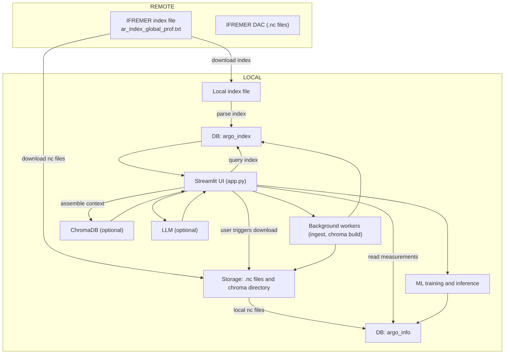
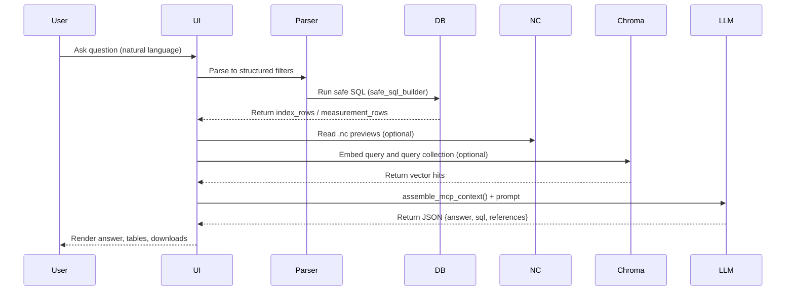

# 🌊 ARGO RAG Explorer

[](LICENSE) [](https://www.python.org/) [](https://streamlit.io) [](https://www.docker.com)

**Tagline:** *An enterprise-grade Streamlit application for ingestion, RAG-enabled exploration, advanced plotting, and multi-model ML workflows over ARGO oceanographic profiles.*

---

🎥 Demo Video: [https://drive.google.com/file/d/1z4KcsmFagrl_vT5KUTiyxQ-sfWzFqrkK/view?usp=drive_link](https://drive.google.com/file/d/1z4KcsmFagrl_vT5KUTiyxQ-sfWzFqrkK/view?usp=drive_link)

## 🔎 Executive summary

ARGO RAG Explorer converts ARGO NetCDF profiles into a queryable relational store, provides advanced interactive visualization, supports Retrieval-Augmented Generation (RAG) and vector search workflows, and exposes a multi-model ML pipeline for predicting oceanographic variables (temperature, salinity, etc.). This README documents the project end-to-end so reviewers and users can quickly understand architecture, workflows, and operational guidance.

---

## 🧩 Full technology stack (summary)

* **Language / runtime:** Python 3.8+
* **Scientific / data:** xarray, netCDF4, pandas, numpy
* **DB / persistence:** SQLAlchemy, SQLite (default), PostgreSQL (optional), joblib, Parquet
* **UI / viz:** Streamlit, Plotly (plotly.express / graph_objects), folium (optional)
* **Retrieval / RAG:** ChromaDB (optional), embeddings (provider optional), LLM adapter (LangChain / provider)
* **ML:** scikit-learn pipelines, RandomForest, GradientBoosting, HistGradientBoosting, XGBoost (optional safe wrapper), LightGBM (optional)
* **Dev / ops:** Docker, multiprocessing background workers, python-dotenv, pytest, black/isort

---

## 🔬 RAG design highlights (production-ready)

* **MCP (Multi-Context Provider)**: assemble context from index row summaries, numeric `.nc` previews, and vector-retrieved chunks.
* **Structured responses**: prompts require JSON `{answer, sql, references}` to make outputs parseable.
* **Fallbacks**: robust rule-based parser when embeddings/LLM unavailable or malformed.
* **Explainability**: retrieval traces (`_mcp_chunks`) included with answers so users can audit sources.
* **Prompt hygiene**: numerical context separated and LLM instructed to avoid unsupported speculation.

---

## 📈 Visualization & plotting capabilities

* Map visualizations: `scatter_mapbox`, clustered points, trajectories with hover (juld, pres, float id).
* Profile plots: Temperature vs Depth (reversed y), Pressure vs Depth, overlay per-profile traces.
* Time-series: Temperature vs Time with rangeslider, spline smoothing optional.
* Model diagnostics: Predicted vs Actual scatter, ensemble uncertainty (std across trees).
* Export: CSV/Parquet/NetCDF exports for reproducibility.

---

## 🧠 Multi-model ML workflow

1. Feature engineering: latitude, longitude, pressure (`pres`), salinity (`psal`), epoch timestamp (`juld_ts`) and engineered features.
2. Sampling & splitting: user-configurable sample size and test fraction.
3. Candidate models: RandomForest, GradientBoosting, HistGradientBoosting, safe XGBoost, LightGBM.
4. Wrappers: each candidate sits inside a `Pipeline` with preprocessing (`StandardScaler`) then estimator.
5. Evaluation & selection: RMSE and R² on holdout; best model persisted with metadata.
6. Persistence: joblib blobs include pipeline, feature list, model name, metrics for traceability.
7. Uncertainty: ensemble-derived std dev used as a simple uncertainty proxy when available.

---

## ▶️ How it runs (concise flow)

1. `ensure_index_file()` downloads IFREMER index; `parse_index_file()` writes `argo_index` rows.
2. `download_netcdf_for_index_path()` fetches `.nc` files when user triggers ingestion.
3. `parse_profile_netcdf_to_info_rows()` flattens measurements into `argo_info`.
4. Streamlit UI reads DB, renders maps/plots, and triggers background workers for heavy tasks (ingest, chroma build).
5. `ask_argo_question()` parses NL → safe SQL → optional .nc previews and vector retrieval → assemble MCP context → invoke LLM → parse JSON answer → render UI.
6. ML training via UI: `load_training_df()` → train candidate pipelines → evaluate → persist winner(s) → use for inference.

---

## 🖼️ Diagrams (Mermaid) — corrected & ASCII fallbacks

> **Important:** GitHub’s default markdown preview does not render Mermaid diagrams. To preview Mermaid, use one of: GitHub Pages with Mermaid enabled, mermaid.live, VSCode Mermaid preview extension, or generate PNGs. Below I provide correct Mermaid source plus an ASCII fallback for each diagram.

### 1) System architecture (high level)



**ASCII fallback (architecture)**

```
REMOTE:
  IFREMER index file -> Local index file -> parse_index_file() -> argo_index (DB)
  IFREMER DAC (.nc)   -> download to STORAGE -> parsed -> argo_info (DB)

LOCAL:
  Streamlit UI reads argo_index and argo_info
  Streamlit triggers background workers to ingest index or build chroma
  ML training reads argo_info; RAG uses chroma + LLM
```

---

### 2) RAG request lifecycle (sequence)



**ASCII fallback (RAG sequence)**

```
User -> UI -> Parser -> DB
    -> (nc previews, chroma retrieval) -> assemble context -> LLM -> structured answer -> UI
```

---

### 3) ML training & inference pipeline

```mermaid
flowchart LR
  A[argo_info DB]
  B[Feature engineering
lat, lon, pres, psal, juld_ts]
  C[Train / Test split]
  D[Model candidates
RF, GB, HistGB, XGB, LGB]
  E[Pipelines: Scaler + Estimator]
  F[Evaluate: RMSE, R2]
  G[Select best model]
  H[Persist: joblib (pipeline + metadata)]
  I[Inference: Load and predict
Ensemble uncertainty if available]

  A --> B
  B --> C
  C --> D
  D --> E
  E --> F
  F --> G
  G --> H
  H --> I
```

**ASCII fallback (ML pipeline)**

```
argo_info -> feature engineering -> train/test split -> train multiple models -> evaluate -> pick best -> save -> load & infer
```

---

## 🛠️ Installation & quick start

1. Clone: `git clone <repo-url>`
2. Create venv:

   * mac/linux: `python -m venv .venv && source .venv/bin/activate`
   * windows: `python -m venv .venv && .venv\Scripts\activate`
3. Install: `pip install -r requirements.txt`
4. Create `.env` with DB url and optional LLM/embedding keys (do not commit).
5. Run: `streamlit run app1.py`

**Demo tip:** set `rows_to_index` to a small number (100–1000) during demos.

---

## 🛡️ Testing & reproducibility

* Add `pytest` tests for ingestion/parsing (`parse_index_file`, `parse_profile_netcdf_to_info_rows`) and query builders (`safe_sql_builder`).
* Save model artifacts with `features` and `metrics` keys for reproducibility.
* Use Docker for stable demo environments; include small sample data in `tests/data/` for CI.

---

## ✅ Pre-demo checklist

* [ ] `requirements.txt` includes optional extras (e.g., `[chroma]`, `[xgboost]`).
* [ ] Small demo dataset included for CI and demos.
* [ ] UI control or CLI flag to cap `rows_to_index`.
* [ ] Joblib artifacts include `features` and `metrics`.
* [ ] CONTRIBUTING.md with demo steps and expected dataset.

---

## 📬 Contributions & support

PRs welcome. For major changes open an issue first so we can discuss design. For questions, feature requests, or help running the app locally, open an issue.

---

*Updated: corrected Mermaid source (no HTML tags inside nodes) and explicit ASCII fallbacks. If GitHub preview still doesn't render diagrams, I can export PNGs of the diagrams and update the README to reference them.*
