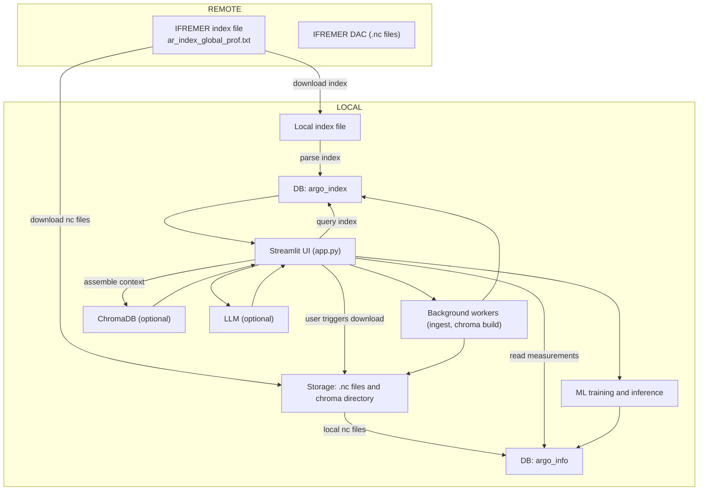
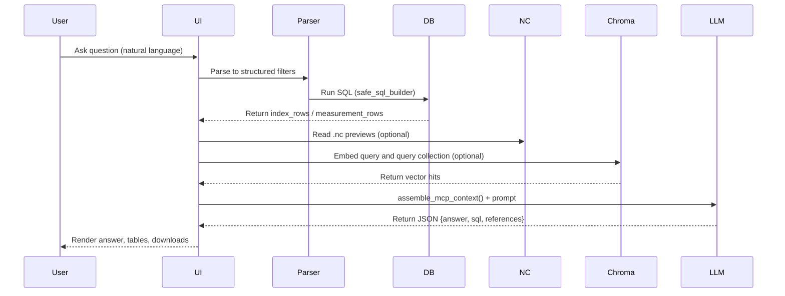

# 🌊 ARGO RAG Explorer

[](LICENSE) [](https://www.python.org/) [](https://streamlit.io) [](https://www.docker.com/)

**Tagline:** *An enterprise-grade Streamlit application for ingestion, RAG-enabled exploration, advanced plotting, and multi-model ML workflows over ARGO oceanographic profiles.*

---

🎥 Demo Video: https://drive.google.com/file/d/1z4KcsmFagrl_vT5KUTiyxQ-sfWzFqrkK/view?usp=drive_link
## 🔎 Executive summary

ARGO RAG Explorer is a production-focused research application that converts ARGO NetCDF profiles into a queryable relational store, provides advanced interactive visualization, supports Retrieval-Augmented Generation (RAG) and vector search workflows, and exposes a multi-model ML pipeline for predicting oceanographic variables (temperature, salinity, etc.).

This README documents the entire technology surface — every major library and capability — so users, reviewers, and hiring managers can immediately see the engineering depth and scientific rigor of the project.

---

## 🧩 Full technology stack (all techs used and optional integrations)

### Core language & runtime

* **Python 3.8+** (development & runtime)

### Data processing & scientific

* **xarray** — read and manipulate NetCDF (`.nc`) datasets.
* **netCDF4** (backend dependency for xarray) — low-level NetCDF I/O.
* **pandas** — tabular ingestion, transforms, CSV/Parquet exports.
* **numpy** — numeric arrays and vectorized math.
* **xarray + pandas + numpy** used to robustly parse multi-dimensional ARGO data into per-measurement rows.

### Database & persistence

* **SQLAlchemy** — composable DB layer and schema definitions.
* **SQLite** — default local DB (lightweight & zero-config). Ideal for demos.
* **PostgreSQL (optional)** — production-scale DB via `ARGO_PG_URL`.
* **joblib** — model artifact persistence.
* **parquet / xarray.to_netcdf** — export formats for reproducibility.

### Web UI & Visualization

* **Streamlit** — main interactive UI and orchestration.
* **plotly (plotly.express, plotly.graph_objects)** — interactive, publication-quality plotting.

  * Map visualizations: `scatter_mapbox`, `Scattermapbox` for trajectories and clustered points. Uses OpenStreetMap style; compatible with Mapbox tokens if you have one.
  * Profile plots: Temperature vs Depth, Pressure vs Depth, Temperature vs Time (spline/line), Predicted vs Actual scatter plots.
* **folium** + **streamlit-folium** (optional) — alternative leaflet maps for geospatial UIs.

### Networking & APIs

* **requests** — robust HTTP, with retry logic via `urllib3` `Retry` and `HTTPAdapter`.
* **Nominatim (OpenStreetMap)** — geocoding for place → bounding box (with caching and catalog fallback).

### RAG, LLMs & Vector Search (Retrieval stack)

* **langchain-google-genai** adapter (optional) — Google Gemini integration for generation and structured parsing.
* **Google Generative Embeddings** (optional) — embedding model used when Gemini key provided.
* **ChromaDB** (optional) — vector store for semantic retrieval of profile text chunks.
* **MCP (Multi-Context Provider)** pattern — context assembly mixing index samples, `.nc` previews, and vector hits.
* **Structured JSON responses**: prompts are constrained to return JSON (answer, sql, references) so outputs can be safely parsed and used programmatically.
* Fallback: robust **rule-based parser** when LLM/embeddings not available.

### Machine Learning & Modeling

* **scikit-learn** — pipelines, preprocessing (`StandardScaler`), model wrappers, metrics (RMSE, R²), `Pipeline` orchestration.
* **RandomForestRegressor** — bagged ensemble baseline.
* **GradientBoostingRegressor** — sklearn GBM option.
* **HistGradientBoostingRegressor** — fast histogram-based GBDT.
* **XGBoost** (optional) — XGBoost regressor; code includes a **safe wrapper** (`XGBRegressorSafe`) and fallback lazy instantiation to handle sklearn tag incompatibilities and version mismatch.
* **LightGBM** (optional) — LGBMRegressor support when installed.
* **Model selection & evaluation:** compare multiple models by **RMSE** or **R²**, pick the best, save artifacts with metadata.
* **Ensemble diagnostics:** when underlying estimators exist (e.g., `estimators_` in RandomForest), compute per-tree predictions and report predictive standard deviation for uncertainty estimation.

### Dev / Ops / Misc

* **multiprocessing** — background workers for index ingestion and heavy builds (Chroma), keeping the UI responsive.
* **python-dotenv** — `.env` configuration handling.
* **pytest / tox** (recommended) — unit testing and CI integration.
* **black / isort / flake8** — code formatting & linting recommendations.
* **Docker** — reproducible images for deployment.
* **Kubernetes / Helm** (optional) — for large-scale production deployments.

---

## 🔬 Advanced RAG & Prompting design (what makes this RAG implementation production-ready)

1. **MCP-based context assembly**

   * Combines three sources of evidence: index row summaries, `.nc` previews (exact numeric samples), and vector-retrieved chunks from Chroma.
   * Limits and trims context to the most relevant chunks to avoid token bloat.

2. **Embedding-aware retrieval**

   * If embeddings/Chroma available, queries are embedded and nearest chunks are retrieved to bring semantically similar profiles into context.

3. **Structured LLM outputs**

   * Prompts enforce a **JSON-only response** (`{answer, sql, references}`) to make downstream parsing reliable. This allows the app to optionally run recommended SQL or display LLM references side-by-side.

4. **Safety & fallbacks**

   * If LLM fails to produce valid JSON, the app gracefully falls back to the rule-based parser. Errors are surfaced in UI with debugging chunks attached.

5. **Explainability**

   * The RAG output includes `_mcp_chunks` (the retrieval traces) so researchers can audit which profiles or chunks influenced the generated answer.

6. **Prompt hygiene**

   * System messages instruct the LLM to behave as an *expert oceanographic assistant* and to avoid unfounded speculation. Numeric data are always quoted separately in the context to reduce hallucination risk.

---

## 📈 Plotting & Visualization Capabilities (detailed)

* **Map visualizations**

  * Scatter / clustered map points with custom lightweight grid clustering — good for thousands of points without heavy geometry work.
  * Trajectory plotting with line + markers, interactive hover (juld, pres, float id).
  * Bounding box drawing for query visualization.

* **Profile plots**

  * Temperature vs Depth (reversed y-axis), Pressure vs Depth, per-profile time-sliced overlays.
  * Group-by `juld` to plot per-profile representative traces (shallowest, median, mean, max) selectable by the user.

* **Time-series**

  * Temperature vs Time with spline lines, interactive rangeslider, and per-float color mapping.

* **Model diagnostics**

  * Predicted vs Actual scatter plots, ensemble uncertainty (std across trees), train/test split metrics (RMSE, R²).

* **Export**

  * Download any plot underlying table as CSV, and export entire `argo_info` to Parquet or reconstructed NetCDF for reproducibility.

---

## 🧠 Multi-model ML workflow (how the app finds the "best" model)

1. **Feature engineering:** latitude, longitude, pressure (`pres`), salinity (`psal`), epoch timestamp (`juld_ts`) and optional engineered features.
2. **Sampling & splitting:** user-configurable training sample size and test fraction.
3. **Model candidates:** RandomForest, GradientBoosting, HistGradientBoosting, XGBoost (safe), LightGBM (optional).
4. **Pipelines:** each candidate is wrapped in a `Pipeline` with `StandardScaler` and the estimator — safe, production-friendly preprocessing.
5. **Evaluation & selection:** compute RMSE and R² on a held-out test set; rank by chosen metric and persist the best model.
6. **Persistence & metadata:** saved `joblib` blobs include pipeline, feature list, model name, and metrics for traceability.
7. **Inference & uncertainty:** single-sample prediction UI + ensemble-derived std (if available) to provide simple uncertainty estimates.

This workflow lets researchers quickly iterate on models and capture reproducible artifacts.

---

## 🛠️ Installation & Quick Start (condensed)

1. Clone repository and create virtualenv.
2. Install `pip install -r requirements.txt` (see Tech stack above for minimal & optional dependencies).
3. Create `.env` for GEMINI/API keys and DB paths.
4. `streamlit run app1.py` and use the UI to ingest the index, download sample `.nc`, and explore.

---

## ✅ Operational recommendations

* For **trial/demo**: use SQLite + local storage and index a small subset (`rows_to_index` = 100–1000).
* For **research / production**: run on a server with >=8–16GB RAM, use PostgreSQL, and persist Chroma on disk (DuckDB+Parquet or dedicated Chroma server).
* Cache geocoding results and throttle Nominatim calls to comply with usage policy.
* Monitor disk usage — `.nc` files can accumulate quickly; provide a retention policy or a cache-cleaner job.

---

## 🔁 Reproducibility & provenance

* Every saved model artifact contains a `features` key and `metrics` list for experiment provenance.
* Exported Parquet / NetCDF artifacts let you reproduce training datasets exactly as used.

---


## 📌 Final notes — What makes this project stand out

* **End-to-end**: from raw `.nc` ingestion to ML inference and RAG answers — a complete pipeline demonstrating scientific data engineering.
* **RAG with provenance**: retrieval traces (`_mcp_chunks`) and JSON-structured LLM outputs allow auditability and reproducibility.
* **Production thinking**: safe wrappers, background workers, optional vector stores, and DB migrations show engineering rigor beyond a toy demo.
* **Practical ML**: multi-model training, safe XGBoost fallbacks and ensemble uncertainty calculation demonstrate a realistic model lifecycle.

---

## ▶️ Working (How it actually runs — step-by-step)

Below is a concise operational description of the system’s runtime behavior. It explains how data flows from remote sources, how user queries are resolved, and how ML and RAG components interact.

1. **Index acquisition** — `ensure_index_file()` downloads the IFREMER index if missing and `parse_index_file()` transforms it into tabular rows. These are stored in the `argo_index` table.
2. **Profile ingestion** — for selected index rows `download_netcdf_for_index_path()` fetches `.nc` files. `parse_profile_netcdf_to_info_rows()` flattens per-profile variables into many `argo_info` rows and `ingest_info_rows()` writes them into the DB.
3. **Exploration & mapping** — the Streamlit UI reads `argo_index` for point/metadata queries, and `argo_info` for measurements. Maps and plots are produced with Plotly and optionally Folium.
4. **RAG query flow** — `ask_argo_question()` parses the natural-language question (LLM or rule-based), constructs SQL (`safe_sql_builder`), optionally fetches `.nc` previews and vector hits, assembles MCP context, invokes LLM, and parses structured JSON responses. The UI renders the answer and provides index/measurement tables and downloads.
5. **ML lifecycle** — `load_training_df()` builds the training dataset from `argo_info`. User selects models/hyperparameters in UI, trains pipelines, evaluates on a holdout, and saves best model(s) with `joblib`. Saved models can be loaded for single-sample prediction and batch evaluation.

---

## 🖼️ Diagrams (Mermaid) — corrected

Below are corrected Mermaid diagrams that visualize the architecture and ML pipeline. Paste them into a Markdown viewer that supports Mermaid (GitHub, GitLab, mermaid.live) to render. ASCII fallbacks follow each diagram.

### 1) System architecture (high level) — corrected



**ASCII fallback (architecture)**

```
REMOTE:
  IFREMER index file -> Local index file -> parse_index_file() -> argo_index (DB)
  IFREMER DAC (.nc) -> download to STORAGE -> parsed -> argo_info (DB)

LOCAL:
  Streamlit UI reads argo_index and argo_info
  Streamlit triggers background workers to ingest index or build chroma
  ML training reads argo_info; RAG uses chroma + LLM
```

---

### 2) RAG request lifecycle (sequence)



---

### 2) ML training & inference pipeline — corrected

```mermaid
flowchart LR
  ARGO_INFO["argo_info DB"]
  DataPrep["Feature engineering\nlat, lon, pres, psal, juld_ts"]
  Split["Train / Test split"]
  Candidates["Model candidates\nRF, GB, HistGB, XGB, LGB"]
  Pipelines["Pipelines: Scaler + Estimator"]
  Evaluate["Evaluate: RMSE, R2"]
  Select["Select best model"]
  Persist["Persist: joblib (pipeline + metadata)"]
  Inference["Inference: Load and predict\nEnsemble uncertainty if available"]

  ARGO_INFO --> DataPrep --> Split --> Candidates --> Pipelines --> Evaluate --> Select --> Persist --> Inference
```




---
